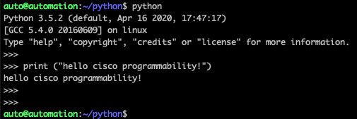
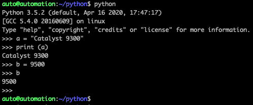
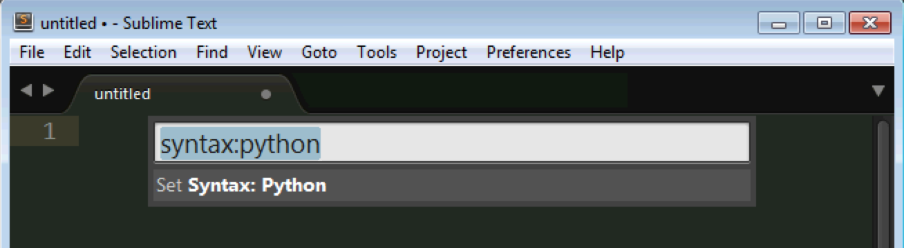
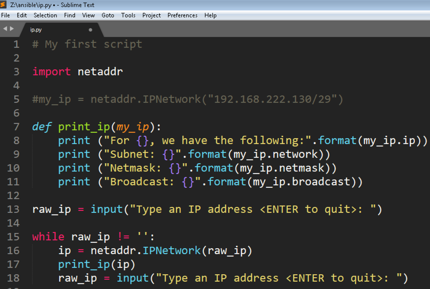

## **[IOS XE Programmability Lab](https://github.com/jeremycohoe/cisco-ios-xe-programmability-lab)**

## **Module: Python**

## Topics Covered 
Getting Started with Python

Basic Python

Your first script 


## Getting Started with Python


We will begin this lab with a very simple introduction to Python, the most commonly used scripting language for network automation.

## Basic Python

There are two ways to run Python:

**Interactive Mode**. In interactive mode, you enter Python commands which are immediately executed by the Python interpreter.

**Script Mode**. In this mode, you have saved a Python script to a text file and will be running the entire script.

We will begin with the interpreter so you can gain some basic experience.

1. Open a SSH session to your Ubuntu Server. Double-click the **MobaXterm** icon on the desktop.

2. Move into the **python** directory.

3. Type **python** to enter the Python shell

```
auto@automation:~$ 
	
cd python
	
auto@automation:~/python$
	
auto@automation:~/python$ python
```

4. This will put you at an interactive prompt. Type a network engineer's version of "Hello world!", the first program coders try in any new language:

```
Python 3.5.2 (default, Apr 16 2020, 17:47:17)
[GCC 5.4.0 20160609] on linux
Type "help", "copyright", "credits" or "license" for more information.
>>>
>>> print ("hello cisco programmability!")
hello cisco programmability!
>>>
```



5.  Let's take a look at variables in Python. A variable is used to represent a piece of data. Try the following:

```
>>> a = "Catalyst 9300"
	
>>> print (a)
	
Catalyst 9300
	
>>> b = 9500
	
>>> b
	
9500
```



This shows a variable can be assigned to a text value or a number value. In the examples above we use the **print** statement to show the contents of a variable. In the Python interpreter one can examine the contents of a variable by simply typing its name:

```
>>> a
	
Catalyst 9300
```

Notice the value is returned within single quotes. This method is not applicable within Python scripts, thus the print statement is commonly used within Python scripts instead.

6.  Now try the following:
	
```
>>> c = ["Cisco", 'Catalyst', 12345]
	
>>> c[0]
	
'Cisco'
	
>>> c[1]
	
'Catalyst'
	
>>> c[2]
	
12345
```
	
	
In Python we can take a number of values and pack them into a single **list** variable. We can access any element of the list by placing the element number in square brackets; but keep in mind the numbering starts at [zero]{.underline}! In Python we can use single or double-quotes to denote a text string.
	
Note: A Python list is similar to an array in other languages, but unlike many languages, in Python we can mix variable types in a single list. (Strings, numbers, objects, etc.)

7. Next, type the following into the interpreter

```
>>> for item in c:** for item in c:
print (item)

Cisco
	
Catalyst
	
12345
	
>>>
```

	
We just iterated through a list using a **for** loop. Try iterating through the other variables we created (**a** and **b**). What happens and why?

8. If you are familiar with **for** loops from another language, they may look a little different in Python. You probably remember iterating through a series of numbers. We can do this in Python as well, but we need to use a special syntax. Try the following

```

>>> for n in range(1,4):** **\<Enter\>**
	
**print (n)** **\<Enter\>**
	
**\<Enter\>**
	
1
	
2
	
3

```

The result may surprise you. Python stops before it gets to 4. This is normal, and you have to take this into account when using **range**. In most cases this means the range max value should be set to n+1.

9. Math is very easy in Python. Let's add the number variables together:

```
>>> b + c[2]
21845
>>>
```

Note that we added the standalone variable **b** to the third item in our list **c**.
	
10. We can also use the plus operator to concatenate strings:

```
>>> d = c[0] + c[1] + 9500
Traceback (most recent call last):
File "<stdin>", line 1, in <module>
TypeError: Can't convert 'int' object to str implicitly
>>> d = c[0] + c[1] + "9500"
>>> print (d)
CiscoCatalyst9500
>>>	
```

Our first attempt to add these strings together failed, because 9500 is a number, not a string. We need to enclose it in quotes before Python will accept it.
	
This was great, except we needed to add spaces. An easier way to do this is with the **format** command:
	
```
>>> d = "{} {} {}".format(c[0], c[1], "9500")
>>> d
'Cisco Catalyst 9500'
>>>
```
	
This syntax may look a little scary, but it is quite simple. **format** is a method (think function, or simply a command) that can be called on a text string. When invoked, **format** replaces any empty curly braces {} with the items in the parentheses, in sequence. Thus, we passed **format** our three text strings from our list "c" and it produced one big string "d", which included the spaces in between the curly braces.


11. Let's examine one more Python data structure before we move on. Python can store data in a **dictionary**, which is similar to a list. Unlike a list, however, you can retrieve information from dictionaries using **keys**, instead of numbered indexes. Try this:

```
>>> switch = {'name':'c9300', 'ip':'10.1.1.1', 'username':'admin', 'password':'cisco123'}
>>> switch['name']
'c9300'
>>> switch['password']
'cisco123'
>>>
```
	
Instead of a number we can access specific elements of a dictionary with key names. We still enclose the key in brackets, as we did with lists. We can also iterate through the dictionary using a **for** loop like we did before (try it if you have time.)
	
**Note**: If you are having trouble with the dictionary, be sure you used curly braces to define it, that you enclosed each key and value with quotes, and that you put commas between each value. Also note that while we define the dictionary with curly braces, we access each element with square brackets.
	
Congratulations! You've worked through many of the basics of Python. We will cover more Python syntax as we go through the lab.

12. Type Ctrl-d or exit() to exit from python interactive shell

# Your first script


13.  Virtual environments is to create an isolated environment for the projects. This means that each project can have its own dependencies, regardless of what dependencies every other project has. In this lab you will run NCClient, Jinja2, netaddr and other packages in an isolated environment. Open the ubuntu terminal and activate virtual environment "v".

auto@automation:~/python\$ **source v/bin/activate**

```
(v) auto@automation:~/python\$
```

Note: observe (v) at start of the 2nd line after you activated. This confirms that you are in virtual environment.

14. On the Windows host, open **Sublime Text 3** from the Start menu. Press **ctrl-shift-P** and enter "syntax:python" into the text box that appears, followed by <Enter>. This will enable Python syntax highlighting.



Enter the following into the window:

```
# My first script

import netaddr

my_ip = netaddr.IPNetwork("192.168.222.130/29")
print ("For {}, we have the following:".format(my_ip.ip))
print ("Subnet: {}".format(my_ip.network))
print ("Netmask: {}".format(my_ip.netmask))
print ("Broadcast: {}".format(my_ip.broadcast))

```

Now, save the file as **z:\\ip.py.** Return to the Ubuntu CLI, and invoke the script from the command line with **python ip.py**. You should see the following:

```
(v) auto@automation:~/python\$ **python ip.py**

For 192.168.222.130, we have the following:

Subnet: 192.168.222.128

Netmask: 255.255.255.248

Broadcast: 192.168.222.135

(v) auto@automation:~/python\$
```


In the simple script above, there are quite a few things going on.

First, we added a comment to the script. Like a line in IOS that begins with "!", in Python, a line that begins with "\#" is ignored by the interpreter. Commenting your code makes it more readable, not only for others but for yourself!

Next, we import a module called **netaddr**. This module contains functions for working with IP addresses, so you don't have to write the code yourself. Python has a huge number of modules you can install and access for free.

Then, we create an IP network object called **my\_ip**. When we create an object of type **IPNetwork**, we have to prefix it with the name of the module where we got the object type.

Finally, we print out the attributes of this IP address, using the format method we learned earlier. Our **netaddr** library gives our **IPNetwork** object several attributes, which we can access just by putting a dot and calling the attribute name. How do we know what attributes? Either from the documentation for the library or by using the Python dir() function!

Start the Python interpreter entering Python in the Ubuntu CLI and type the following:

```
>>> import netaddr
>>> my_ip = netaddr.IPNetwork("192.168.222.130/29")
>>> type(my_ip)
<class ‘netaddr.ip.IPNetwork’>
>>> dir(netaddr.ip.IPNetwork)
```

You should see the following:

```
<snip>
, 'broadcast', 'cidr', 'first', 'hostmask', 'info', 'ip', 'ipv4', 'ipv6', 'is_ipv4_compat', 
'is_ipv4_mapped', 'is_link_local', 'is_loopback', 'is_multicast', 'is_private', 'is_reserved', 
'is_unicast', 'iter_hosts', 'key', 'last', 'netmask', 'network', 'next', 'prefixlen', 'previous', 
'size', 'sort_key', 'subnet', 'supernet', 'value', 'version']
>>>
```


15. Our code would be more useful if we could re-use it and pump any address into it. Let's make it into a function. Return to the Sublime window and select the four print lines in the **z:\\ip.py** file and then indent them by pressing **ctrl-\]**. Then, add the following line above the indented statements:

```
def print_ip(my_ip):
```

Be sure the **def** line is **not** indented, and don't forget the colon! Now comment out this line by adding the \# to it:

```
#my_ip = netaddr.IPNetwork("192.168.222.130/29")
```

and add the following code *below* the print statements and save the file. (Note: do *not* indent the lines that come before **while**.)

```
raw_ip = input("Type an IP address <ENTER to quit>: ")

while raw_ip != '':
    ip = netaddr.IPNetwork(raw_ip)
    print_ip(ip)
    raw_ip = input("Type an IP address <ENTER to quit>: ")
```


Your final code should look like this (pay close attention to indentation):



What happens when you run it? Try inputting a number of subnet/mask combinations. (Be sure to enter the addresses in slash notation, like this: **192.168.1.0/24)**

We learned a few new things here:

1.  We can re-use code by giving it a name and placing it after a **def** statement. We can pass variables to the new function.

2.  Python is very whitespace-sensitive. If you did not indent your print statements, or the **while** block, the program won't work.

3.  A **while** loop will iterate until the condition specified is met. In this case, we continue to execute the block of code under while until a blank string is encountered.

**Note**: Why did we repeat the line inputting the IP address? If we didn't put the first one, **raw\_ip** would be undefined and Python would generate an error when it got to the **while** block. If we didn't put the second one, Python would just loop indefinitely printing the same output for the same IP! If this happens, hit Ctrl-C to stop it.
